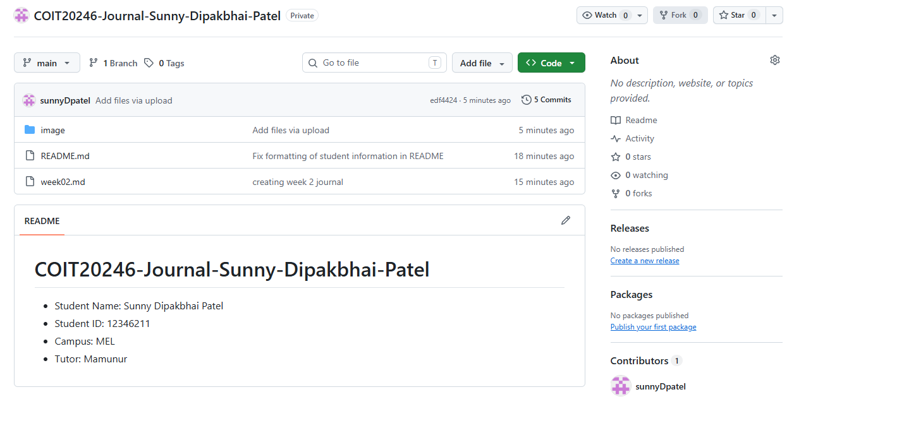
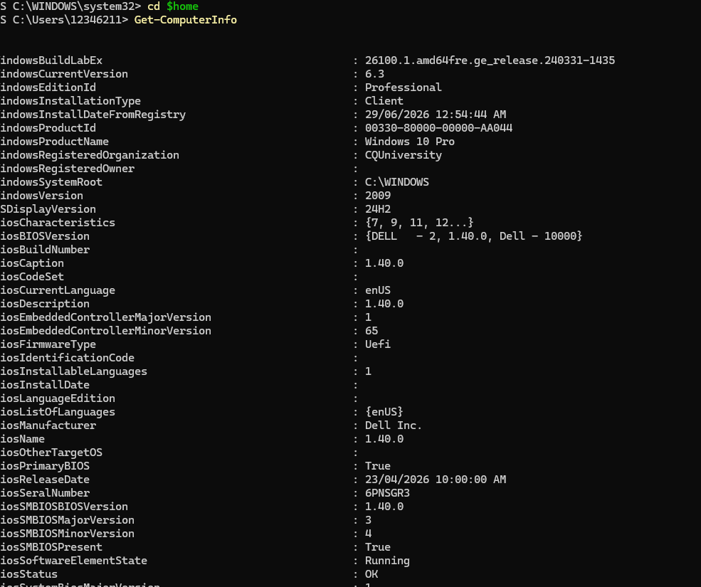
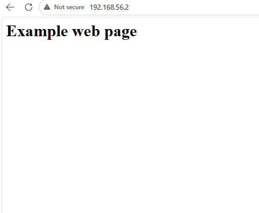
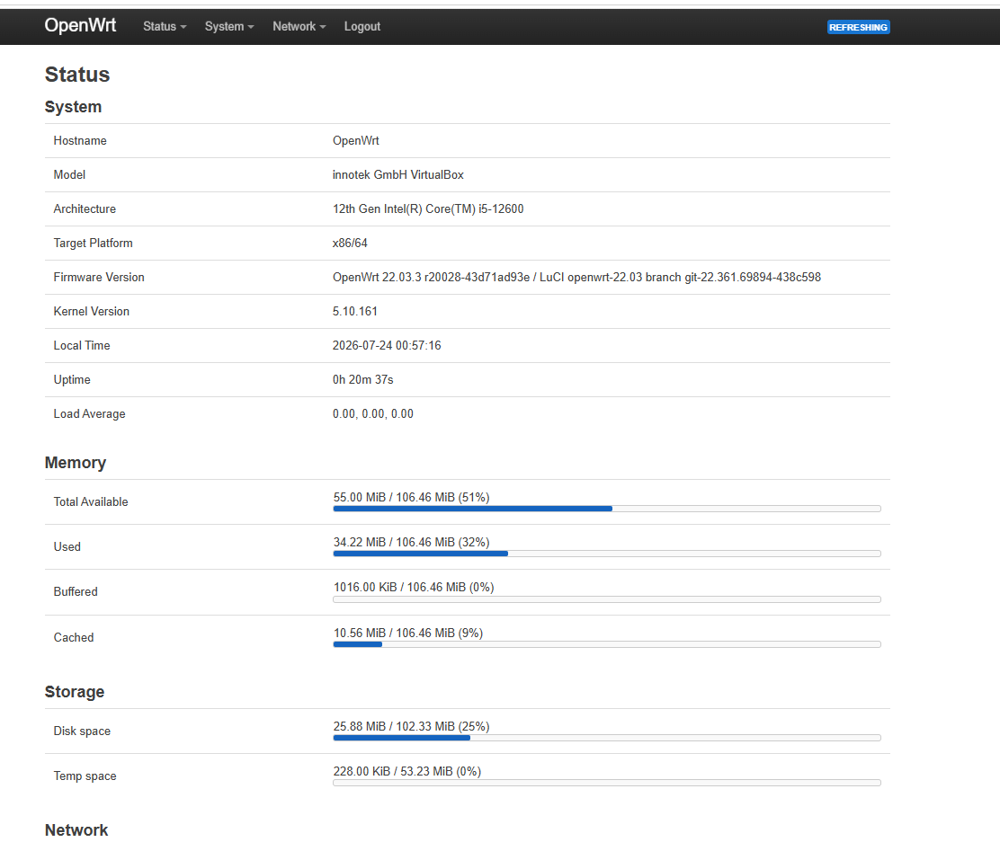

# Week 2 journal

- Activity 1 : creating github acc and creating repo and share with tutor
- 

- Computer Information
    - Ram : 16,073 MB
    - Disk : 8 GB
- 

- Adding opwrt image
- 

- Task 3: question answer :
- 
- Answer 1: The boot manager is GRUB version is 2.06 and Linux kernel is used.

- Answer 2: The VirtualBox is virtualisation software that makes PC use another PC in a virtual manner.
  -The OpenWRT is an operating system which is Linux based.

- Answer 3: My description was brief and explained the basic purpose of VirtualBox and OpenWRT in simple terms. The AI-generated description was more detailed and used technical terms such as virtual machines, networking -           features, and customisation. Both descriptions provide the same basic information, but the AI version gives a deeper explanation suitable for IT students.

- Getting info about ram and size of OpenWRT
- 

- After doing sea*ching about Wrt, information is given below.
-            Architecture : intel core i5 12th Gen 12600
-            Target Platform : x86/64
-            Memory : 106 MB
-            Storage : 102 MB 
