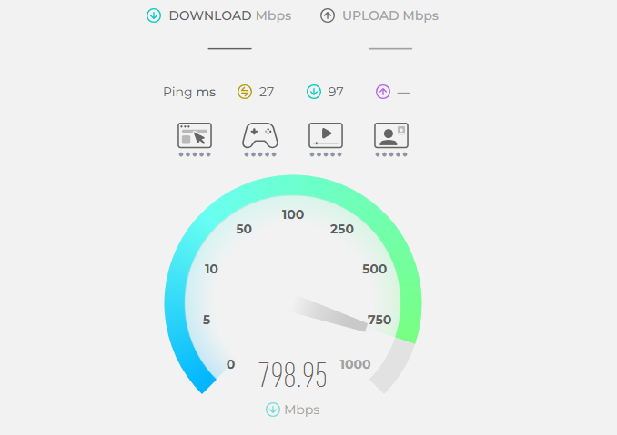
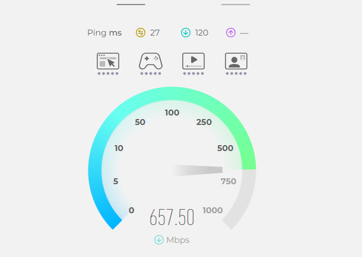

# Week 3 journal

- Task 3 : ping local computer
 

- List The values of Delay Using Test-Connection command in powershell
 

- Task 4 : Address of WRT
-         Command : ifconfig
-         Address : 192.168.56.2

- Ping WRT
-     Command : ping 192.168.56.2
  

- Ping Local Computer Using WRT Machine
-     Command : ping 10.178.32.37
  

- Opem pcap file in wireshark
-  

-  Task 5 :  List the names of the five (5) levels of breach of academic integrity.
-         Level 1 – Inappropriate Academic Conduct
-         Level 2 – Minor Academic Misconduct
-         Level 3 – Moderate Academic Misconduct
-         Level 4 – Substantial Academic Misconduct
-         Level 5 – Serious Academic Misconduct

- Task 7 : Find Website Add4ess.
-          Add4ess : https://www.uber.com/
-          Domain Name : ube*.com
-          Server:  sydeqaddc01.ad.cqu.edu.au
-          Address:  10.8.0.25

- Task 8 : Speed Test
- 
- 
- 
- Connection Type	Home : Wi-Fi (802.11ac / Wi-Fi 5)
- Avg Speed : 25.33
- ISP : 	ABC Broadband
- Due to wifi signal strength and network  conjection, speed might be varies
