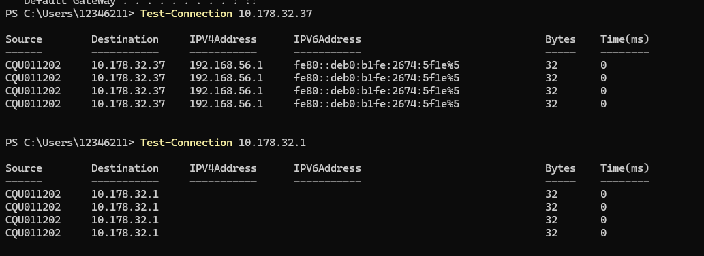
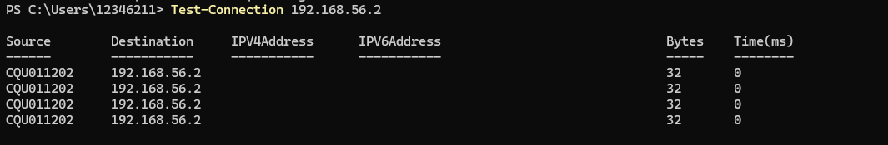
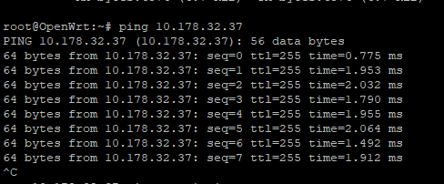
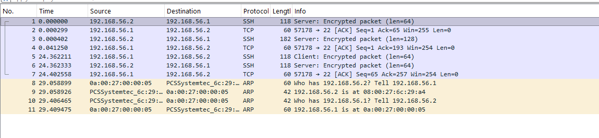

# Week 3 journal

- Task 3 : ping local computer
 

- List The values of Delay Using Test-Connection command in powershell
 

- Task 4 : Address of WRT
-         Command : ifconfig
-         Address : 192.168.56.2

- Ping WRT
-     Command : ping 192.168.56.2
  

- Ping Local Computer Using WRT Machine
-     Command : ping 10.178.32.37
  

- Opem pcap file in wireshark
-  
