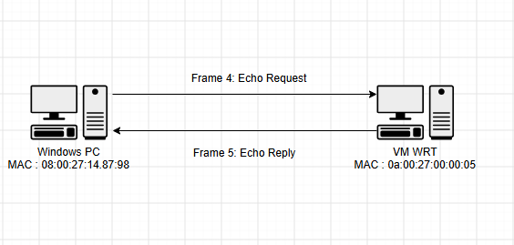

#  Week 4 journal
- Task 3 a: A switched LAN consisting of one switch and four PCs
 

- Task 3 b: A switched LAN with four PCs on one switch, four PCs on another switch and the two switches connected to a third switch in a star configuration.
 

 - Task 4: Look at the packets in Wireshark (some packets are quite similar, so discuss the differences in the packets).  
 

Explain the purpose of ARP Packets.
     Address Resolution Protocol (ARP). It is employed to find out the MAC address of a device when the device's IP address is known.

     As you can see in my capture, Windows was trying to ping the OpenWRT guest at 192.168.1.1. Windows was aware of the IP address, but it required the MAC address of OpenWRT.

     The following is a Windows ARP Request message:

     Who has 192.168.1.1?

     Addressing to the broadcast MAC address:

     ff:ff:ff:ff:ff:ff
- The list below contains explanations of the first two ICMP packets.Below are the explanations to the first two ICMP packets.
   In my packet capture, the first ICMP packet is the #4th packet. It is a request for Echo Reply sent by the virtual machine OpenWRT to Windows PC. When ping is run to see if the OpenWRT VM can be reached, this packet is generated.

   The Windows PC has the MAC address 08:00:27:14:87:98, while the OpenWRT VM has the MAC address 0a:00:27:00:00:05. So, the 4th frame is sent from the Windows PC (MAC address) to the OpenWRT VM (MAC address).

    This is ICMP (echo reply) 2nd Packet - ICMP Type 10 Code 0. Once it receives the Echo Request, it is forwarded back to the Windows PC by the OpenWRT VM. The direction of the communication has         changed, hence the MAC addresses have been reversed.
