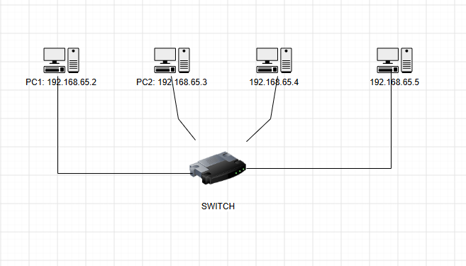
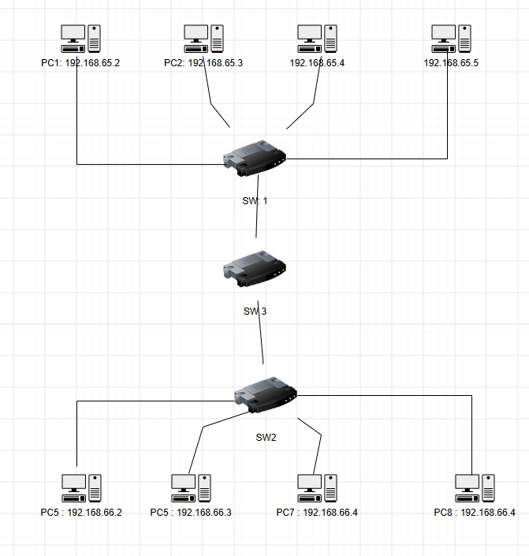

#  Week 4 journal
- Task 3 a : A switched LAN with one switch and four PCs
 

- Task 3 b :A switched LAN that has four PCs connected to one switch, four PCs connected to another switch, and those two switches are connected to a third switch in star topology.
 
