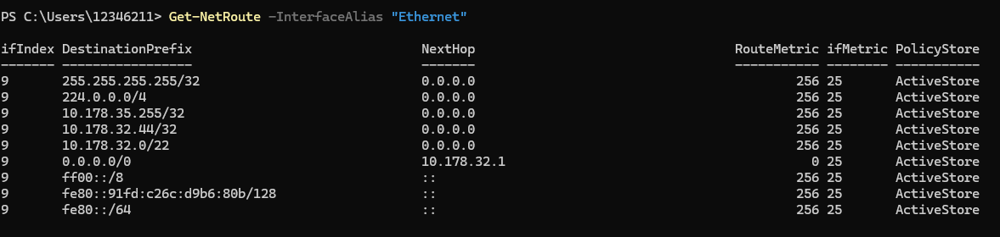
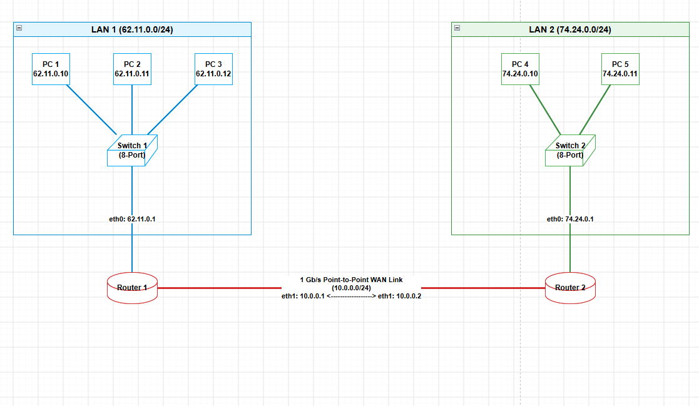
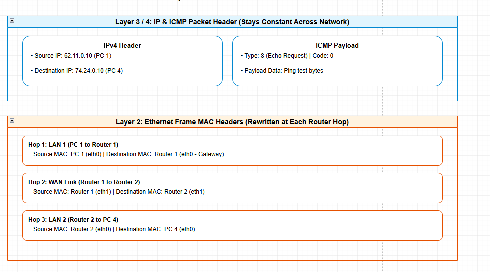
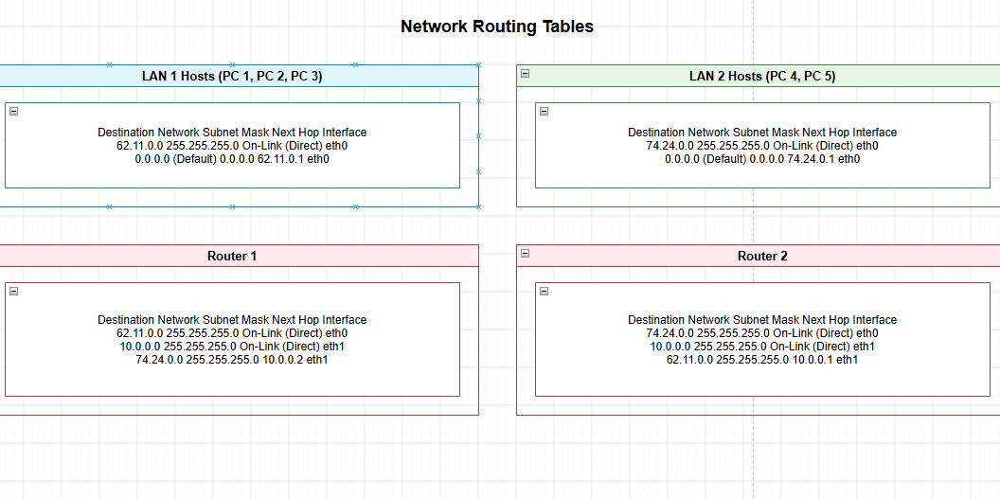

# Week 05

## task 02

Below is a quick summary of each trail:

255.255.255.255/32: IPv4 Limited Broadcast — Network-wide broadcast traffic is sent to all hosts on the local physical segment.

224.0.0.0/4: IPv4 Multicast Range — Directs traffic sent to multicast groups (224.0.0.0–239.255.255.255).

10.178.35.255/32: Subnet Broadcast — Broadcast address specific to the local 10.178.32.0/22 subnet.

Local IPv4 Address — Represents the IP address that this local computer has been assigned.

10.178.32.0/22: Local Subnet Route — Directs traffic to local neighbor devices (10.178.32.1–10.178.35.254) without needing a router.

0.0.0.0/0: Default Gateway — Routes all Internet and external network traffic through gateway router 10.178.32.1.

ff00::/8: IPv6 Multicast Block – All IPv6 group traffic on the local interface.

fe80::91fd:c26c:d9b6:80b: Local IPv6 Address — IPv6 Address assigned to this machine that is used for local communication.

fe80::/64: IPv6 Link-Local Subnet — IPv6 traffic— a reserved address that links together devices that are directly connected on the same physical link.
 IPv6 Link-Local Subnet: IPv6 traffic is sent to other devices that are attached to the same physical link.

 ## task 03
  

| Device | Interface | IP Address/Subnet Mask | Default Gateway |
| :--- | :--- | :--- | :--- |
| PC 1   | eth0 |  62.11.0.10 /24 | 62.11.0.1 |
| PC 2   | eth0 | 62.11.0.11 /24 | 62.11.0.1 |
| PC 3  | eth0 | 62.11.0.12 /24 | 62.11.0.1 |
| Switch 1  | — | Unassigned | — |
|Router 1 | eth0 | 62.11.0.1 /24 | N/A |
| Router 1 | eth1 | 10.0.0.1 /24 | N/A |
| Router 2 | eth1 |  10.0.0.2 /24 | N/A |
| Router 2 | eth0 |    74.24.0.1 /24 | N/A |
| Switch 2 | — | Unasdsigned | — |
| PC 4 | eth0 | 74.24.0.10 /24 | 74.24.0.1 |
| PC 5 | eth0 |   74.24.0.11 /24 | 74.24.0.1 |

## Task 5: IP Address Lookup.

- **Accuracy:** Approximate. It is the city or metropolitan area, not an exact address or street.

- The choice between home Wi-Fi and mobile data.Home Wi-Fi vs Mobile Data.
-          Home Wi-Fi or Broadband IP (e.g., `120.147.45.12`) is correct as broadband IP ranges are associated with the local ISP exchange hubs.
-         Less accurate (often miles away from the location in a central gateway state) using less accurate Carrier-Grade NAT (CGNAT) routing.

- The public IP, ISP name, country, state, and a rough estimate of the city are identified.

- Not identified: Exact street address, GPS location, local private IP (such as `192.168.1.15`) or specific device name.
