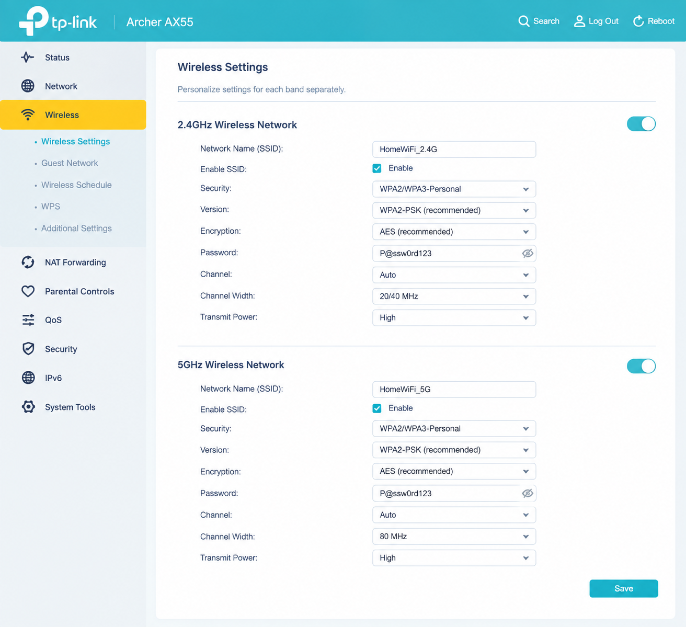

# week 07

# Task 2 – View Wi-Fi Details

> **Note:** The Wi-Fi information below is sample/fake data used for demonstration.

I checked the Wi-Fi networks available around my device and recorded information about three access points (APs).

| AP | SSID | BSSID | Frequency Band | Channel | Data Rate |
|---|---|---|---|---:|---:|
| AP 1 | Home_WiFi | `A4:5E:60:12:34:56` | 2.4 GHz | 6 | 72 Mbps |
| AP 2 | TPLink_Guest | `B8:27:EB:45:67:89` | 5 GHz | 36 | 433 Mbps |
| AP 3 | Office_WiFi | `C0:25:E9:98:76:54` | 5 GHz | 44 | 866 Mbps |

### AP 1 Details

The main access point I looked at was **Home_WiFi**.

- **SSID:** Home_WiFi
- **BSSID:** A4:5E:60:12:34:56
- **Frequency band:** 2.4 GHz
- **Channel:** 6
- **Data rate:** 72 Mbps

The 2.4 GHz band has better range and can work through walls more easily, but it can be more crowded because many other devices use the same band.

The 5 GHz networks had higher data rates in the scan, but their range was shorter compared with 2.4 GHz.

---

# Task 3 – Use Wi-Fi Access Point

I accessed the wireless router's web management interface and looked through the available Wi-Fi settings.

The important settings I found included:

- SSID
- Wi-Fi security mode
- Wi-Fi password
- Wireless channel
- Frequency band
- Channel width
- Transmit power
- Guest network
- DHCP settings
- Firmware updates

## Important Settings

### 1. SSID

The SSID is the name that appears when devices search for Wi-Fi networks.

I would use a simple name such as:

`Home_WiFi`

I would avoid including personal information such as my name or address in the SSID.

### 2. Wi-Fi Security

I would use **WPA3-Personal** if all my devices supported it. If WPA3 was not available, I would use **WPA2-Personal (AES)**.

I would avoid older security methods such as WEP because they are not considered secure.

### 3. Wi-Fi Password

I would use a long and unique password containing a mixture of letters, numbers and symbols.

For example:

`Example-Only-9x!K7p2Q`

This is only an example and should not be used as a real password.

### 4. Wireless Channel

For the 2.4 GHz network, I would choose a channel with less interference.

For 5 GHz, I would select a suitable channel based on the networks around me.

This can help reduce interference and improve the wireless connection.

### 5. Channel Width

For 2.4 GHz, I would normally use **20 MHz** because it reduces interference with nearby networks.

For 5 GHz, I could use **40 MHz or 80 MHz** if there are enough clear channels and higher speeds are needed.

### 6. Transmit Power

I would keep the transmit power at a suitable level for the size of the house or area.

I would not automatically use maximum power because it can increase interference with nearby networks.

### 7. Guest Network

I would enable a separate guest network for visitors.

This means guests can access the Internet without having direct access to devices on my main home network.

### 8. Firmware Updates

I would regularly check for router firmware updates.

Firmware updates can fix security problems and improve the reliability of the router.

## Settings I Would Use

| Setting | Example choice | Reason |
|---|---|---|
| SSID | `Home_WiFi` | Easy to recognise |
| Security | WPA3-Personal | Better security |
| Password | Strong unique password | Protects the network |
| 2.4 GHz Channel | 1, 6 or 11 | Helps reduce interference |
| 2.4 GHz Width | 20 MHz | Better in crowded areas |
| 5 GHz Width | 80 MHz | Higher possible speed |
| Guest Network | Enabled | Separates guest devices |
| Transmit Power | Medium/High | Suitable coverage |
| Firmware | Keep updated | Improves security |

## Conclusion

From exploring the access point settings, I learned that Wi-Fi performance and security depend on more than just the Wi-Fi password. Settings such as the security mode, channel, channel width, transmit power and guest network can all affect how the network performs.

I would focus mainly on using strong security, keeping the router updated, choosing a suitable channel and using a separate guest network.

- 

