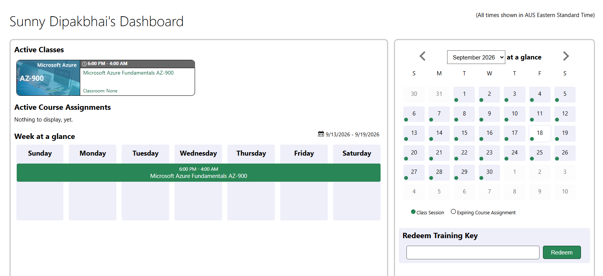
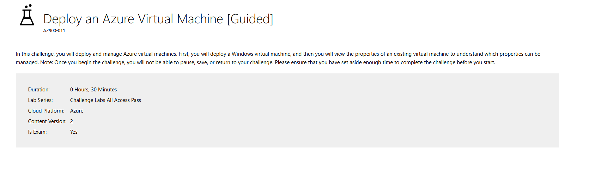
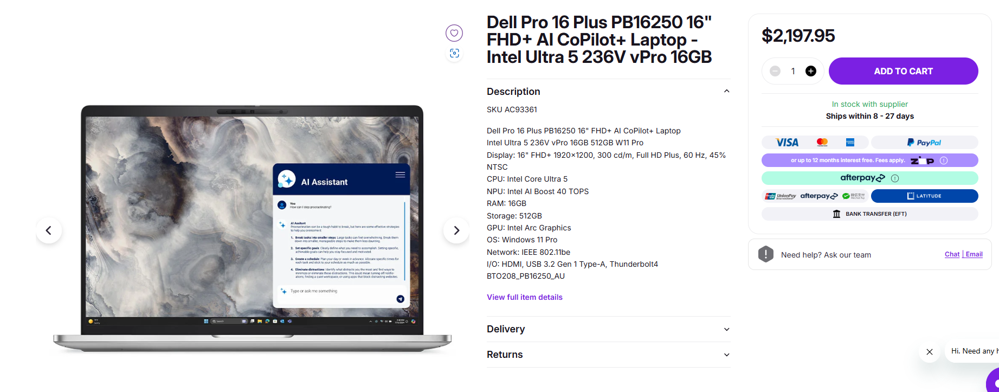
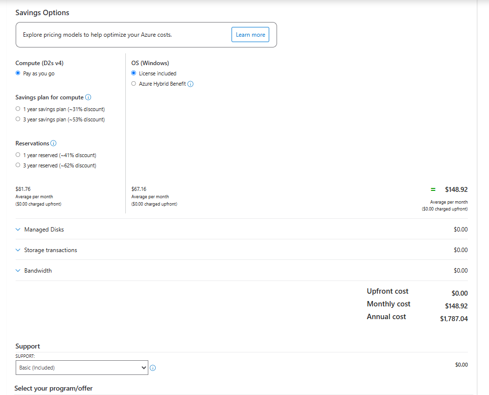

# week 08

## Task 03

## creating user account using key but not able to launch lab as it already week 9 and in week 8 some students including me not able to access that lab as well
- 
- 

## Task 04

In this task, you will create an Azure Virtual Machine and allow Web access.You will do the following: Create an Azure Virtual Machine and Allow Web Access.

### Azure Commands

The commands that are used to create the Ubuntu VM and install Nginx:

```bash
az vm create --resource-group myResourceGroup --name myVM --image Ubuntu2204 --admin-username azureuser --generate-ssh-keys

az vm run-command invoke --resource-group myResourceGroup --name myVM --command-id RunShellScript --scripts "sudo apt-get update && sudo apt-get install nginx -y"
```

### Public IP Address

**Public IP:** `YOUR_PUBLIC_IP_ADDRESS`

### Website Access

At first, it was displaying a Connection timed out message due to the fact that HTTP access was denied.

Created an inbound rule in the Network Security Group via the Azure Portal for HTTP (port 80). Following, the rule was added and the website was available.

Next I logged into the Ubuntu VM via SSH:

```bash
ssh -l azureuser IPADDRESS
```

I used the following to edit the webpage:

```bash
sudo nano /var/www/html/index.html
```

I added my name to the webpage, saved the file and refreshed the browser. I was able to have my name appear on the webpage.

**Screenshot:**
Please insert and paste a screen shot of the webpage that includes your name into it.

### Network Security Rules

| Port   | Protocol | Purpose                                                         |
| ------ | -------- | --------------------------------------------------------------- |
*22 SSH* | Secure login and admin to the Ubuntu VM from a remote location.
| **80** | HTTP     | Allows web browser access to the Nginx web server.              |


## Task 5: Compare the cost of Cloud vs On-premise costs
Compare Consumer PC to Cloud Virtual Machine.Compare between Consumer PC and Cloud Virtual Machine.

The next table shows how the consumer computer measures up against an Azure Virtual Machine. The prices are in Australian dollars (AUD).

Model / Type	Intel NUC Desktop	Azure Virtual Machine (VM)
Type	Dell Pro 16 Plus Laptop	Azure D2s v4 VM
The Intel Core Ultra 5 236V is a 2-vCPU processor.
RAM	16 GB	8 GB
Operating system	Windows 10 Enterprise LTSC 2021 (x64)	Azure managed storage not included
Battery Life	10 Hours 35 minutes	10 Hours 35 minutes
Upfront Cost	$2,197.95	$0.00
Monthly Cost	—	$148.92
1-Year Cost	$2,197.95	$1,787.04
3-Year Cost	$2,197.95	$5,361.12
Consumer PC Cost

The price of consumer computer is $2,197.95 AUD as displayed in the screen shot.

Screenshot:
Paste the PC<->consumer screen shot here.

Azure VM Cost

Based on the Azure Pricing Calculator screen shot:

Monthly cost: $148.92 AUD
Annual cost: $1,787.04 AUD
Upfront cost: $0.00 AUD
3-year running cost: $5,361.12 AUD

Screenshot:
Paste the Azure Pricing Calculator screen shot in here.

Trade-offs

Consumer PC: Consumer pays a significantly higher initial cost, but once purchased no monthly cloud VM charge. It also offers local storage capabilities and will work offline.

Azure VM is free to use upfront and can be used remotely. Flexible in that resources can be modified as needed. But it involves on-going fees each month and over 3 years, the running cost may exceed the cost of purchasing a computer.

The primary consideration is whether to purchase the physical machines and their initial cost, or rely on cloud computing where there are ongoing costs, and is more flexible.
- 
- - 

